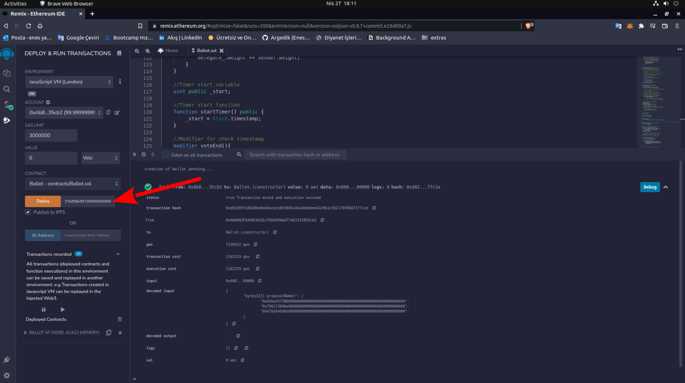

# ZKU-ONE-Background-Assignment

(You can access the "pdf"s in the "documents" section.)

 Some green text 
Let's start by deploying the "Hello world" smart contract.

We write the "storeNumber" function to store our unsigned number. For example; “512”
We write the "retrieveNumber" function to display the unsigned number we have stored.

Here we create several new wallet accounts to be able to use the "ballot contract".

After compiling our "ballot.sol" file, we enter the addresses we created in the "Deploy" section as a list.
Example;
["0x656e657300000000000000000000000000000000000000000000000000000000", "0x796173696e000000000000000000000000000000000000000000000000000000", "0x676564696b000000000000000000000000000000000000000000000000000000"]

We start our 5-minute period with "startTimer". We can learn when "Timer" starts with ".start" and when it ends with "getTimeLeft".

If we can't vote within 5 minutes according to the code we wrote in our contract, we will get the "timer is done" error.

Let's vote in less than 5 minutes :)

